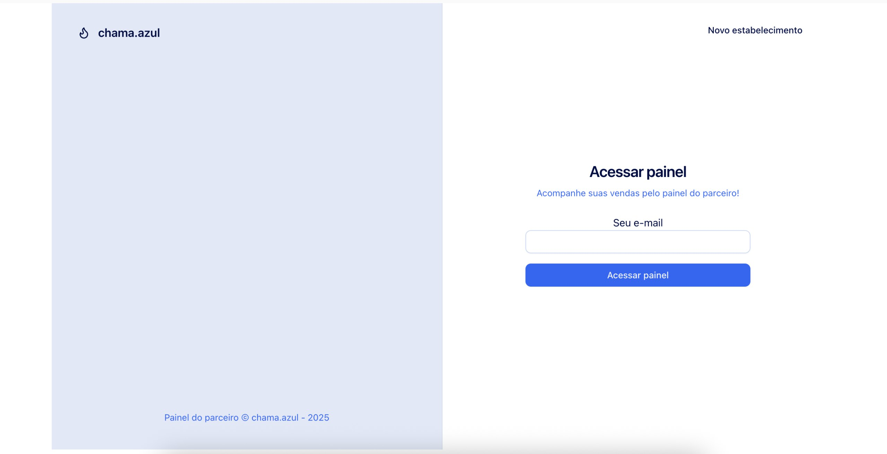
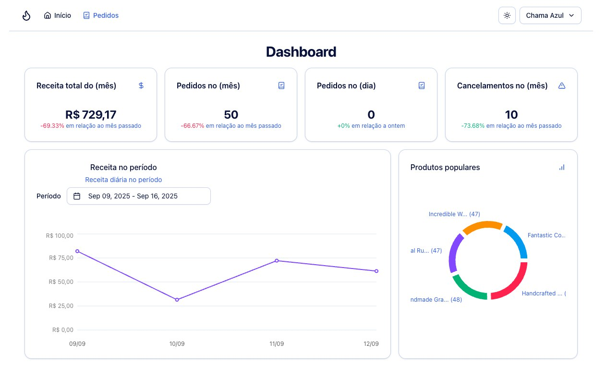
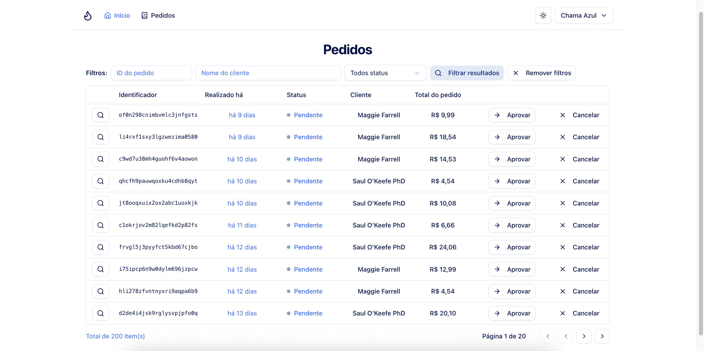
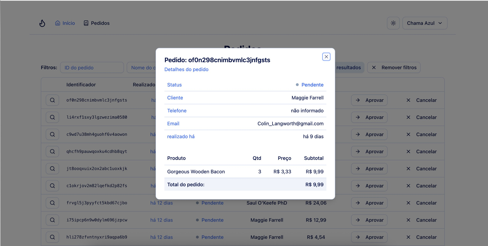

## Service Management System

The project simulates the operation of an online restaurant, allowing users to browse the menu, view, filter, approve, or cancel orders. The application was built with the latest technologies, focusing on providing an intuitive user experience.

## Tools Used

- React
- React Router DOM
- Tailwind CSS
- shadcn/ui
- React Query
- Radix

## Key Learnings

- JWT Authentication
- Caching and Revalidation
- Backend Connection (API)
- Unit Testing

## Features

- Restaurant registration;
- Restaurant login (magic link);
- Customer registration;
- Creation of new orders;
- Menu management;
- Review management;
- Order managment;
- Restaurant profile management;
- pen/closed status for the restaurant;
- Dashboard metrics:
- Order chart for the last 15 days;
- Sales chart for the last 15 days;
- Average reviews (monthly/overall);
- Average orders per day (monthly/overall);
- Sound notifications for new orders (change favicon);